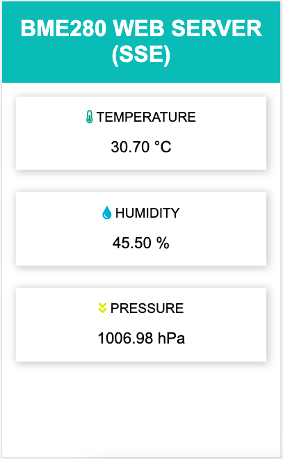
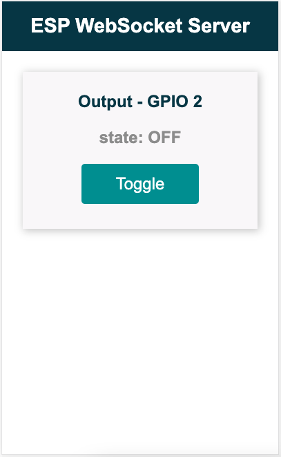
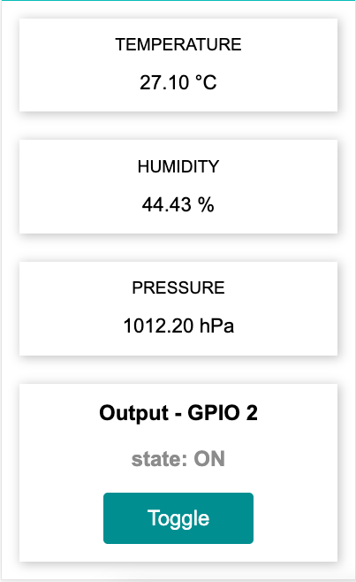
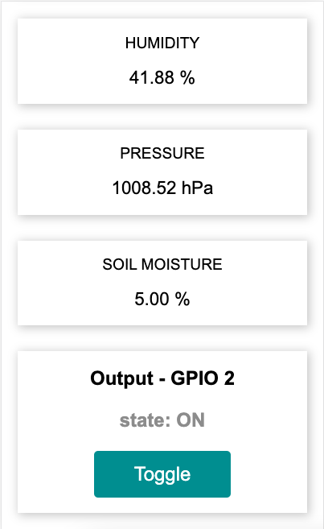

# nodemcu-bme280-webserver

Dashboard
- Temperature
- Humidity 
- Pressure 

Control Outputs

Dashboard + Control Outputs

Dashboard + Control Outputs + Soil Moisture

Source: https://randomnerdtutorials.com/esp8266-nodemcu-web-server-sent-events-sse/

GPIO Pin: https://randomnerdtutorials.com/esp8266-pinout-reference-gpios/
