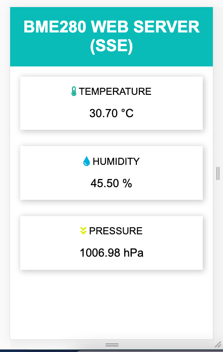
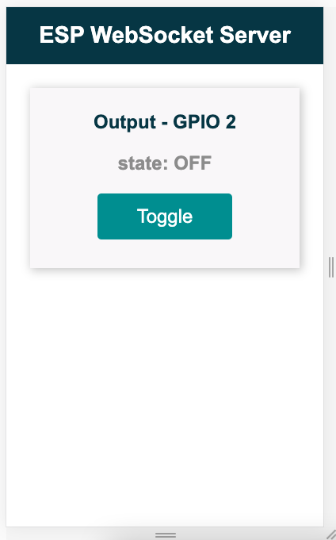

# nodemcu-bme280-webserver

Dashboard
- Temperature
- Humidity 
- Pressure 

Control Outputs

Dashboard + Control Outputs

Source: https://randomnerdtutorials.com/esp8266-nodemcu-web-server-sent-events-sse/
